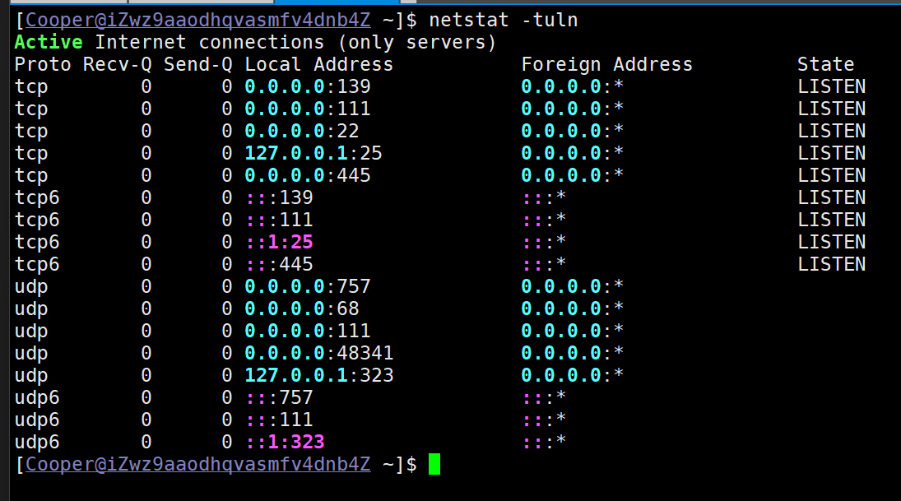
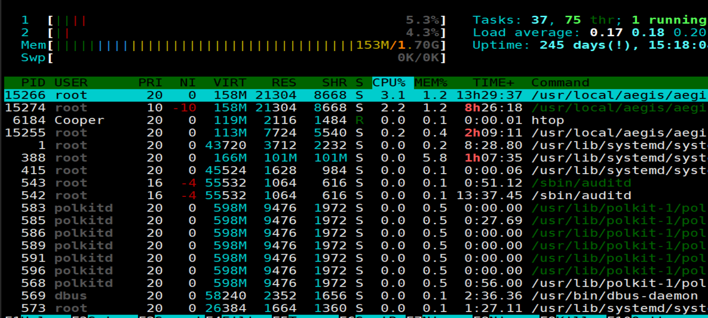

+++
title = 'Xshell主题配色文件'
date = 2024-11-13T23:26:05+08:00


categories = ["Xshell"] 
tags = ["配色"]

+++


# `Xshell`突出显示配置


1. 将命名为 **`XshellColor.hls`** 的文件准备好。

2. 将该文件放置到以下目录：
   **`C:\Users\Your_name\Documents\NetSarang Computer\7\Xshell\HighlightSet Files`**

   （请将 `Your_name` 替换为您的实际用户名）

3. 打开 Xshell 后，即可在颜色设置中选择该高亮配置文件。

4. 我这是黑暗版风格, 偏护眼 







```
[Keyword_0]
TermBackColor=1
Underline=1
Bold=0
Strikeout=0
Keyword=[_a-z0-9-]+(.[_a-z0-9-]+)*@[a-z0-9-]+(.[a-z0-9-]+)*
Description=Email address
BackColorIndex=286
UseRegex=1
Italic=0
Enable=0
TextColorIndex=286
CaseSens=0
[Keyword_1]
TermBackColor=1
Underline=0
Bold=1
Strikeout=0
Keyword=(?=(\b|\D))(((\d{1,2})|(1\d{1,2})|(2[0-4]\d)|(25[0-5]))\.){3}((\d{1,2})|(1\d{1,2})|(2[0-4]\d)|(25[0-5]))(?=(\b|\D))\s*
Description=IPv4
BackColorIndex=292
UseRegex=1
Italic=0
Enable=1
TextColorIndex=295
CaseSens=0
[Keyword_2]
TermBackColor=1
Underline=0
Bold=1
Strikeout=0
Keyword=[\[ ]?\s*((([0-9A-Fa-f]{1,4}:){7}([0-9A-Fa-f]{1,4}|:))|(([0-9A-Fa-f]{1,4}:){6}(:[0-9A-Fa-f]{1,4}|((25[0-5]|2[0-4]\d|1\d\d|[1-9]?\d)(\.(25[0-5]|2[0-4]\d|1\d\d|[1-9]?\d)){3})|:))|(([0-9A-Fa-f]{1,4}:){5}(((:[0-9A-Fa-f]{1,4}){1,2})|:((25[0-5]|2[0-4]\d|1\d\d|[1-9]?\d)(\.(25[0-5]|2[0-4]\d|1\d\d|[1-9]?\d)){3})|:))|(([0-9A-Fa-f]{1,4}:){4}(((:[0-9A-Fa-f]{1,4}){1,3})|((:[0-9A-Fa-f]{1,4})?:((25[0-5]|2[0-4]\d|1\d\d|[1-9]?\d)(\.(25[0-5]|2[0-4]\d|1\d\d|[1-9]?\d)){3}))|:))|(([0-9A-Fa-f]{1,4}:){3}(((:[0-9A-Fa-f]{1,4}){1,4})|((:[0-9A-Fa-f]{1,4}){0,2}:((25[0-5]|2[0-4]\d|1\d\d|[1-9]?\d)(\.(25[0-5]|2[0-4]\d|1\d\d|[1-9]?\d)){3}))|:))|(([0-9A-Fa-f]{1,4}:){2}(((:[0-9A-Fa-f]{1,4}){1,5})|((:[0-9A-Fa-f]{1,4}){0,3}:((25[0-5]|2[0-4]\d|1\d\d|[1-9]?\d)(\.(25[0-5]|2[0-4]\d|1\d\d|[1-9]?\d)){3}))|:))|(([0-9A-Fa-f]{1,4}:){1}(((:[0-9A-Fa-f]{1,4}){1,6})|((:[0-9A-Fa-f]{1,4}){0,4}:((25[0-5]|2[0-4]\d|1\d\d|[1-9]?\d)(\.(25[0-5]|2[0-4]\d|1\d\d|[1-9]?\d)){3}))|:))|(:(((:[0-9A-Fa-f]{1,4}){1,7})|((:[0-9A-Fa-f]{1,4}){0,5}:((25[0-5]|2[0-4]\d|1\d\d|[1-9]?\d)(\.(25[0-5]|2[0-4]\d|1\d\d|[1-9]?\d)){3}))|:)))(%.+)?\s*\]?
Description=IPv6
BackColorIndex=292
UseRegex=1
Italic=0
Enable=1
TextColorIndex=294
CaseSens=0
[Keyword_3]
TermBackColor=1
Underline=0
Bold=1
Strikeout=0
Keyword=(\berror\b)|(\bfail(ed)?\b)|(\bfalse\b)|(\bdown\b)|(\blocked\b)
Description=error, fail, false, down
BackColorIndex=292
UseRegex=1
Italic=0
Enable=1
TextColorIndex=290
CaseSens=0
[Keyword_4]
TermBackColor=1
Underline=0
Bold=1
Strikeout=0
Keyword=(\bactive(d)?\b)|(\bsuccess(ful(ly)?)?\b)|(\btrue\b)|(\bok\b)|(\bup\b)|(\brunning\b)|(\bdeployed\b)|(\bunlocked\b)
Description=active, success, true, ok, up
BackColorIndex=292
UseRegex=1
Italic=0
Enable=1
TextColorIndex=291
CaseSens=0
[Keyword_5]
TermBackColor=1
Underline=1
Bold=1
Strikeout=0
Keyword=(\bstart(ed|ing)?\b)|(\bbegin(ning)?\b)|(\benable(d)?\b)|(\bcreate(d)?\b)|(\bopen\b)
Description=start, begin, enable, create, open
BackColorIndex=292
UseRegex=1
Italic=0
Enable=1
TextColorIndex=291
CaseSens=0
[Keyword_6]
TermBackColor=1
Underline=1
Bold=1
Strikeout=0
Keyword=(\bstop(ped)?\b)|(\bend\b)|(\bfinish(ed)?\b)|(\bdisable(d)?\b)|(\bdelete(d)?\b)|(\bclose(d)?\b)
Description=stop, end, finish, disable, delete
BackColorIndex=292
UseRegex=1
Italic=0
Enable=1
TextColorIndex=293
CaseSens=0
[Keyword_7]
TermBackColor=1
Underline=0
Bold=1
Strikeout=0
Keyword=(\bwarn(ing)?\b)|(\binactive\b)|(\bunknown\b)
Description=warn, inactive, unknown
BackColorIndex=292
UseRegex=1
Italic=1
Enable=1
TextColorIndex=282
CaseSens=0
[Colors]
Colors=000000,00E4FF,000040,0080FF,400000,C08080,8080FF,C0C0C0,555555,5555FF,55FF55,55FFFF,FF5555,FF55FF,FFFF55,FFFFFF
[Keyword_8]
TermBackColor=1
Underline=0
Bold=1
Strikeout=0
Keyword=(\binfo\b)
Description=info
BackColorIndex=292
UseRegex=1
Italic=0
Enable=1
TextColorIndex=291
CaseSens=0
[Keyword_9]
TermBackColor=1
Underline=0
Bold=1
Strikeout=0
Keyword=\bDEBUG\b
Description=debug
BackColorIndex=292
UseRegex=1
Italic=0
Enable=1
TextColorIndex=293
CaseSens=0
[info]
Version=1.1
Count=12
[Keyword_10]
TermBackColor=1
Underline=0
Bold=1
Strikeout=0
Keyword=\/\b(\d|([1-9]\d)|(1[01]\d)|(12[0-8]))\b
Description=CIDR
BackColorIndex=292
UseRegex=1
Italic=0
Enable=1
TextColorIndex=284
CaseSens=0
[Keyword_11]
TermBackColor=1
Underline=0
Bold=1
Strikeout=0
Keyword=([a-zA-Z0-9._-]+@([a-zA-Z0-9_-]+\.)+[a-zA-Z0-9_-]+)
Description=Email Regex
BackColorIndex=292
UseRegex=1
Italic=0
Enable=1
TextColorIndex=286
CaseSens=0
```

