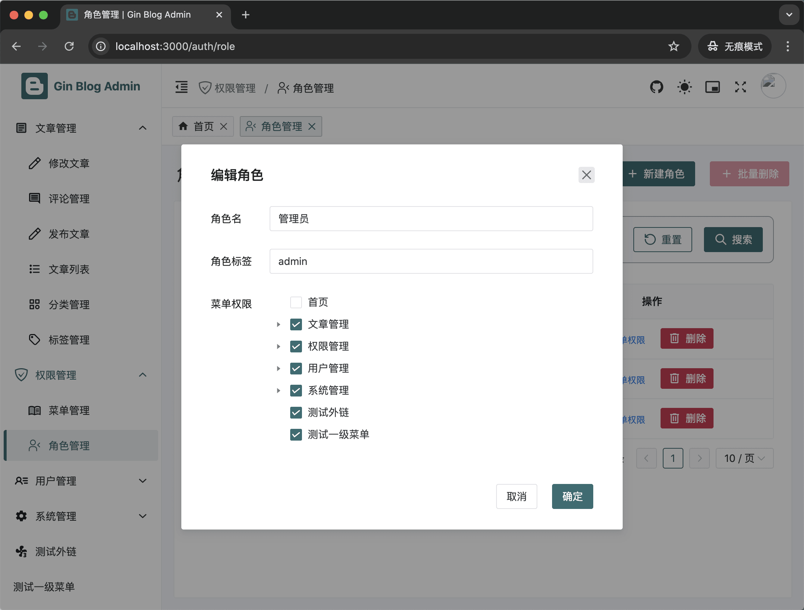

## 一个golang + vue3 + Naive ui的后台管理  

## 项目介绍  
   - 本项目后台前端部分基于[gin-vue-blog](https://github.com/szluyu99/gin-vue-blog)这个项目, 感谢开源作者的奉献。
   - [组件文档](https://www.naiveui.com/zh-CN/os-theme/components/tree)

## 实现功能
   - 权限模块 前端登陆用户仅能拿到它自己所属角色的功能路由，由后端接口传来一个基础的菜单数组, 前端组装成可访问的路由格式。
   - 业务模块 如：帖子文章 评论等
   - 用户模块 
   - 系统模块

## 项目图片展示
  #### 后台 
    
    
    
   
   
##  启动
  - nvm use v22.11.0
  - pnpm run dev

## 相比 Vue Naive Admin 项目的变化 
   原则：一个问题不需要太多解决方案，所以本项目中只保留最常用的解决方案，如果实在不能解决需求，需要自行添加 
   基于 Vue Naive Admin, 本项目在其基础上更新了很多，主要是为了精简项目, 对接后端, 大致列出如下:

   整体结构：
   - 去除 Mock: 因为项目有真实的后端, 无需 Mock
   - 去除 build 文件夹, 因为去除了很多插件 (unplugin 全部去除), 所以并不必须
   - 对接真实后端数据, 添加后端路由等功能

   插件相关：
   - 去除 unplugin 系列所有插件: `unplugin-auto-import`, `unplugin-icons`, `unplugin-vue-components`
   - 去除 `vite-plugin-html`, `vite-plugin-mock`, `vite-plugin-svg-icons`: 本项目中未使用
   - 去除 prettier, 统一使用 eslint
   - 去除 `@commitlint/cli`, `@commitlint/config-conventional`: 非必须, 追求精简
   - 去除 `lint-staged`, `husky`: 本项目是大仓库的子项目, 不需要提交前检查
   - 去除 `@unocss/preset-rem-to-px` 插件，一般情况下不需要转换字体
   - 添加 taze 插件: 用于升级依赖

   去除 unplugin 系插件的主要原因有以下：
   - 这些插件并不涉及业务功能上的必须, 只是为了方便开发
   - 为了降低项目的耦合性, 以及项目对插件的依赖性, 提高项目移植的便捷性, 去除这些插件
   - 这些插件某种程度上可以让单人开发者的开发效率提高, 但是根据经验发现不便于维护, 对其他人不友好
   - 可能会导致一些奇奇怪怪的问题

   UnoCSS - `uno.config.js` 中: 以下预设都不是必须, 追求精简
   - 去除 presetAttributify 预设
   - 去除 shortcuts
   - 去除 rules
   - 采用 @unocss/reset 代替 reset.css
   - 图标统一使用 UnoCSS 的使用方法, 使用 presetIcons 预设

## 代码风格控制

关于项目中为什么不使用 Prettier，参考 Antfu 大佬： [为什么我不使用 Prettier](https://antfu.me/posts/why-not-prettier-zh)

Eslint 方案采用 [https://github.com/antfu/eslint-config](https://github.com/antfu/eslint-config)，最大化减少配置
