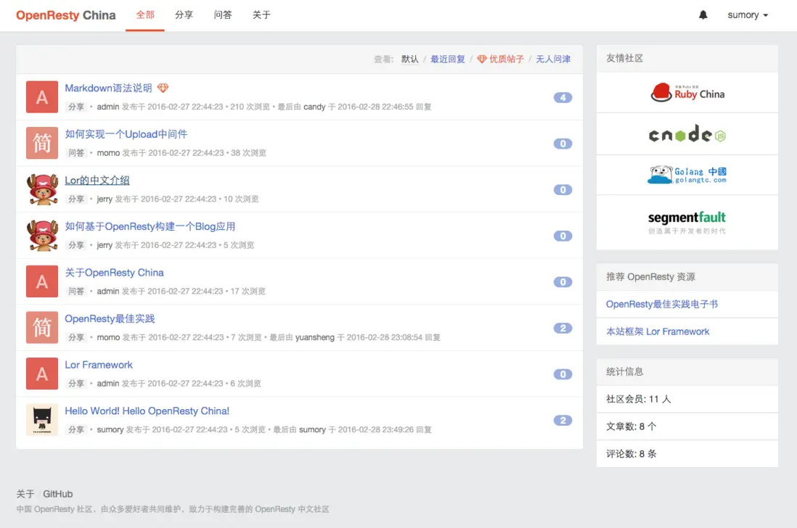
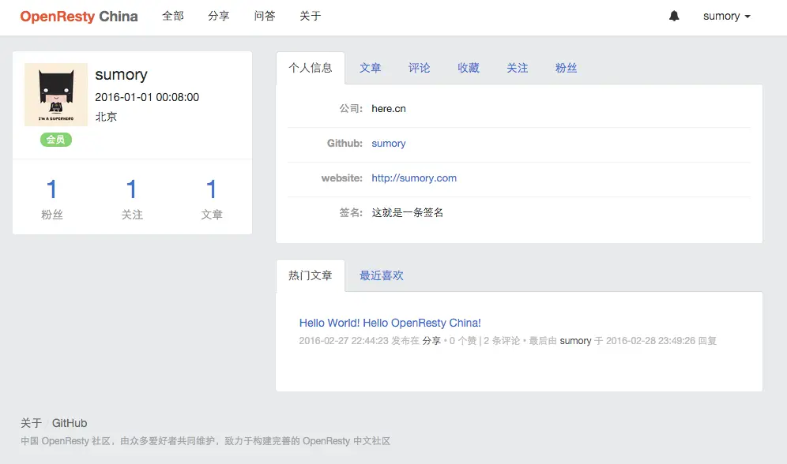
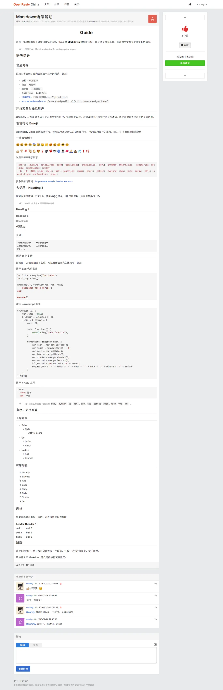

## 项目介绍  
  - 一个运行在[OpenResty](http://openresty.org)上的发帖论坛。
  - 本项目前端部分基于 bootstrap

---

## 特点
- 简洁  
- 高性能
- 代码完全采用ngx-lua + mysql实现
- 来自饭总的[openresty-china](https://github.com/sumory/openresty-china)项目
---

## 描述
- 适用于公司内部论坛,随拿随用

---

## 案例项目图片展示
  #### 后台 
    
   
     
  
---


## 项目目录简介
```
app:          http api服务代码
lor:          http服务框架代码
resty:        第三方基础库代码
conf:         配置
``` 

---


## 安装
``` 
安装mysql 省略 导入数据库 conf/openresty_china_2022-04-24.sql 
[root@iZ~]#wget https://openresty.org/download/openresty-1.11.2.3.tar.gz
[root@iZ~]#tar xvf openresty-1.11.2.3.tar.gz
[root@iZ~]#cd openresty-1.11.2.3
./configure --with-luajit && make && make install
[root@iZ~]#cd /data/web
[root@iZ~]#git clone git@github.com:poembro/openresty-im.git 
[root@iZ~]#/usr/local/openresty/sbin/nginx -c /data/web/openresty-china/conf/nginx.conf
```
 

 