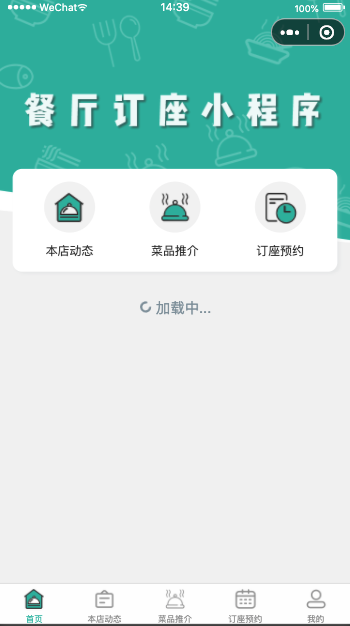
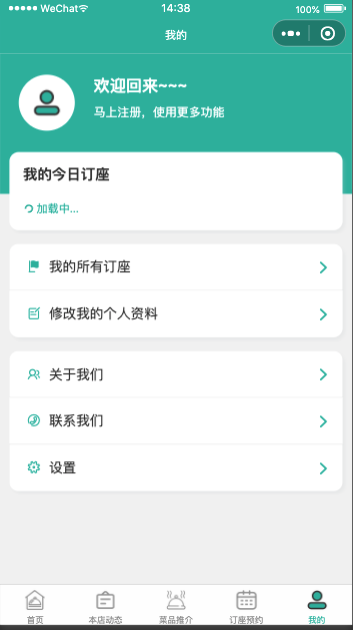

## 项目介绍
- 一个微信小程序,采用原生模板写法 开发的 餐厅预约订座与核销。
- 客户可以在小程序内进行卡座/包厢（不同规格大小）的订座服务，可进行小沙发卡座、大沙发卡座、多人桌、包间桌等各种类型的订座，同时完成不同时间段的预约， 前后端完整代码包括餐厅动态，菜品推介，新菜上市，预约订座，我的今日订座，后台订座管理与时段设置，订座名单查看与导出Excel，客户资料登记管理等功能，采用腾讯提供的小程序云开发解决方案，无须服务器和域名

## 特点
- 运行在微信提供的 云函数 环境 
- 订座管理：开始/截止时间/人数均可灵活设置，可以自定义客户预约填写的数据项
- 订座凭证核销：支持线下到场后校验签到/核销/二维码自助签到等多种方式
- 详尽的订座预约数据：支持预约名单数据导出Excel，打印

---

## 实现方案
- 采用 微信小程序原生模版语法 + js语言编写
- 使用腾讯专门的小程序云开发技术，云资源包含云函数，数据库，带宽，存储空间，定时器等，资源配额价格低廉，无需域名和服务器即可搭建。
- 小程序本身的即用即走，适合小工具的使用场景，也适合快速开发迭代。
- 云开发技术采用腾讯内部链路，没有被黑客攻击的风险，安全性高且免维护。
- 资源承载力可根据业务发展需要随时弹性扩展。  

## 案例项目图片展示
  #### 游戏 
      
    

    
 