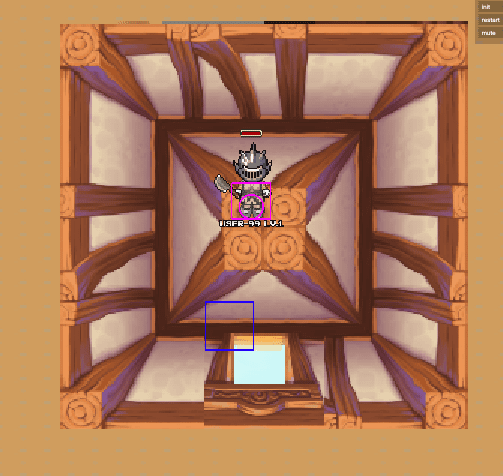
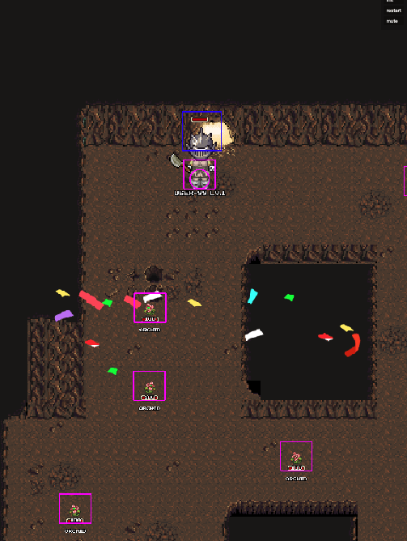
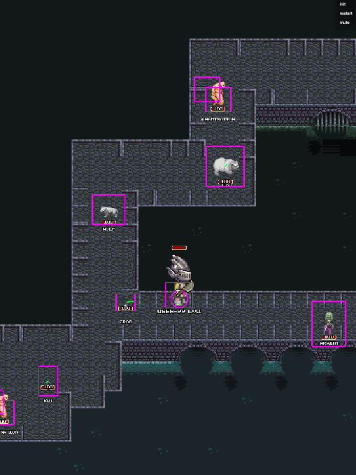
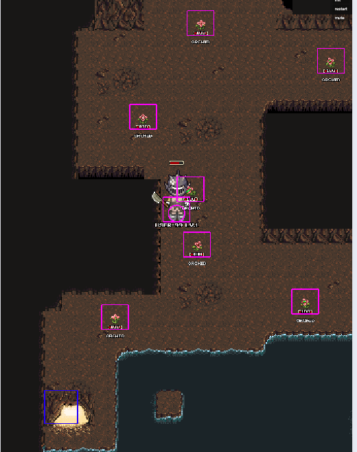

## 项目介绍
- 一个 Phaser 3 开发的 RPG闯关游戏，通用化场景地图，怪物坐标 掉落回血物品及坐标等，支持小白用户使用  Tiled 自定义 各个关卡。
- 目前是 aether 项目的改版，还处于开发阶段 

## 实现方案
- 采用 phaser3 + ts 混合 js 语言编写
- 采用 Tiled 编辑地图，以及行走区域 
- 采用 rollup  打包

## 案例项目图片展示
  #### 游戏 
    
   
     
     

## Available Commands (可用命令)

| Command | Description |
|---------|-------------|
| `npm install` | Install project dependencies |
| `npm run watch` | Build project and open web server running project, watching for changes |
| `npm run dev` | Builds project and open web server, but do not watch for changes |
| `npm run build` | Builds code bundle with production settings (minification, no source maps, etc..) |

## Writing Code （编写代码）

After cloning the repo, run `npm install` from your project directory. Then, you can start the local development
server by running `npm run watch`. The first time you run this you should see the following demo run:

