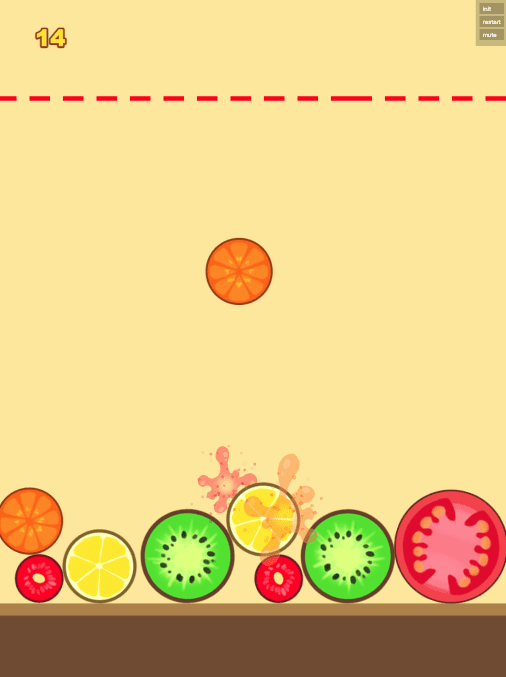
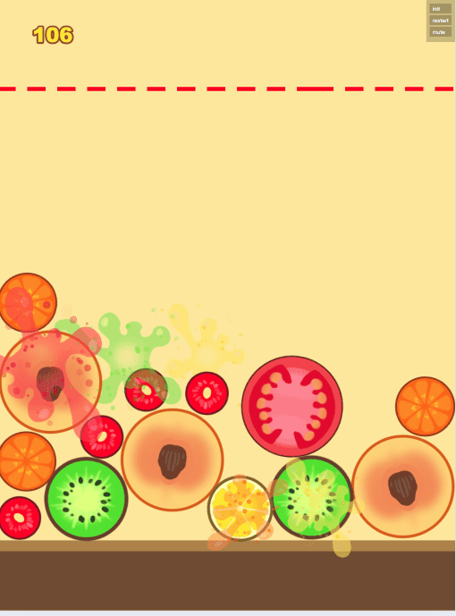
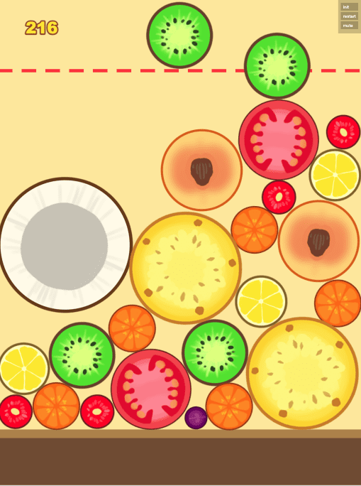
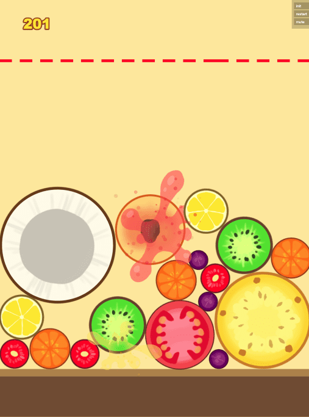

## 项目介绍
- 一个 Phaser 3 开发的h5休闲小游戏合成大西瓜， 一共有11个类型的水果，随机掉落后组合， 最后合成最大的11号西瓜。
- 目前是 matter物理引擎  项目作者是 [eijil](https://github.com/eijil/hexigua) 非常好的参考学习案例

## 实现方案
- 采用 phaser3 + ts语言编写
- 采用 matter物理引擎，放射粒子效果动画 
- 采用 rollup  打包

## 案例项目图片展示
  #### 游戏 
    
   
     
     

# Phaser 3 TypeScript Project Template

## demo

[http://hexigua.surge.sh/](http://hexigua.surge.sh/)

## Available Commands

| Command | Description |
|---------|-------------|
| `npm install` | Install project dependencies |
| `npm run watch` | Build project and open web server running project, watching for changes |
| `npm run dev` | Builds project and open web server, but do not watch for changes |
| `npm run build` | Builds code bundle with production settings (minification, no source maps, etc..) |

## Writing Code

After cloning the repo, run `npm install` from your project directory. Then, you can start the local development
server by running `npm run watch`. The first time you run this you should see the following demo run:

