### 一、项目介绍

购物商城基于Spring Boot是一个便捷、高效、灵活的项目开发框架，适用于快速构建现代化的Java应用程序。在该系统中，我们利用Spring Boot来构建一个面向购物商城的系统，以实现购物商城、公告信息、订单处理等功能。

### 二、功能介绍

#### 游客功能
- **登录**： 允许游客进行登录操作，输入用户名和密码进行身份验证。 
- **注册**： 允许游客创建新用户账户，填写必要的个人信息并完成注册过程。 
- **查看商品信息**： 游客可以浏览系统中的农产品信息，包括名称、价格、产地、规格等。 
- **查看公告信息**：  游客可以查看系统发布的公告，了解系统活动、促销信息等。

#### 用户功能
- **商品信息**： 用户可以浏览农产品信息，查看商品的详细信息，包括价格、产地、规格等。 
- **公告信息**：  用户可以查看系统发布的公告，了解系统活动、促销信息等。
- **个人中心**： 用户可以个人信息，包括修改密码、更新个人资料等。
- **查看订单**： 用户可以查看已完成和进行中的订单，了解购买历史和订单状态。
- **收藏商品**：  用户可以将感兴趣的商品加入收藏列表，便于以后查看或购买。
- **购物车**： 用户可以将选定的商品加入购物车，方便统一和结算。

#### 管理员功能
- **个人中心**： 管理员可以个人信息，包括修改密码、更新个人资料等。
- **用户**： 管理员可以进行用户操作，包括查看用户列表、修改用户权限、禁用用户等。
- **商品分类**： 管理员可以商品分类，包括添加、修改、删除商品分类信息。
- **商品信息**： 管理员可以商品信息，包括添加、编辑、删除商品信息。
- **系统**：  管理员可以系统设置，包括配置系统参数、公告信息等。
- **订单**： 管理员可以查看和订单，包括订单状态更新、订单详情查看等。

 
### 四、项目图片展示

#### 1、前台

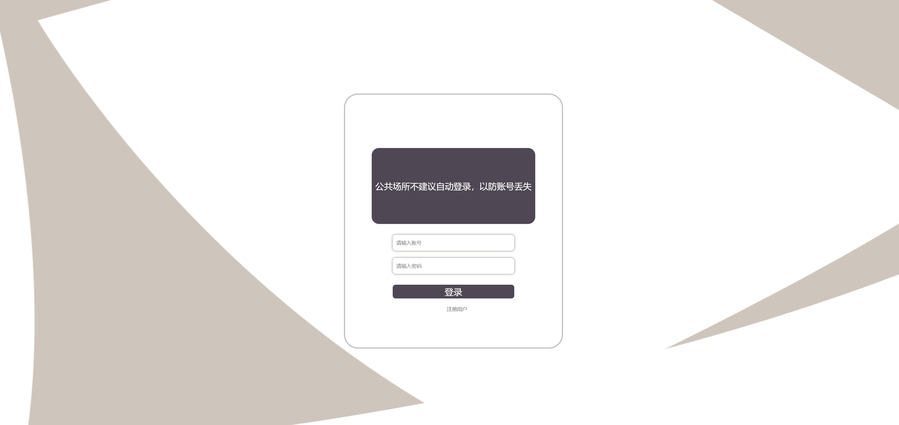

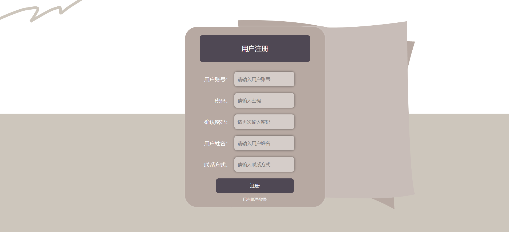

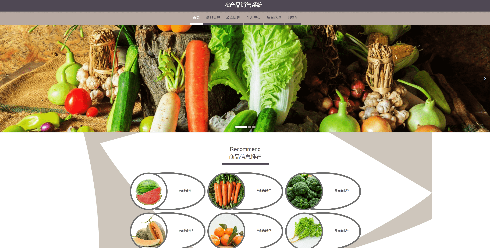

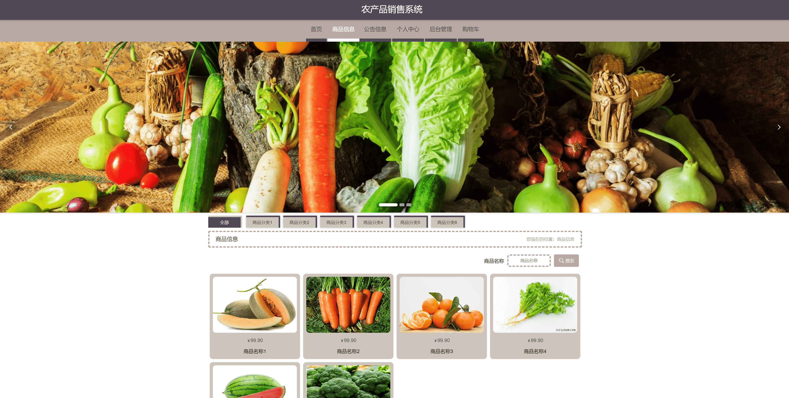

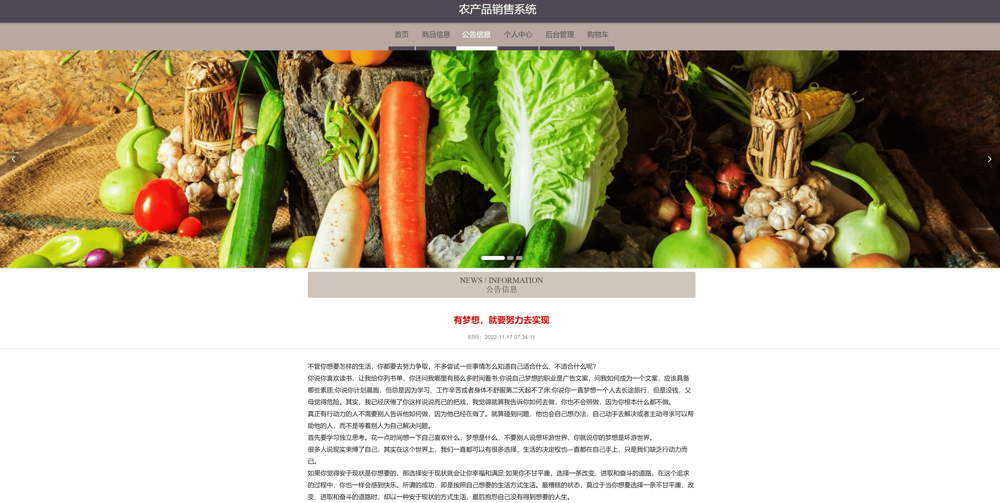

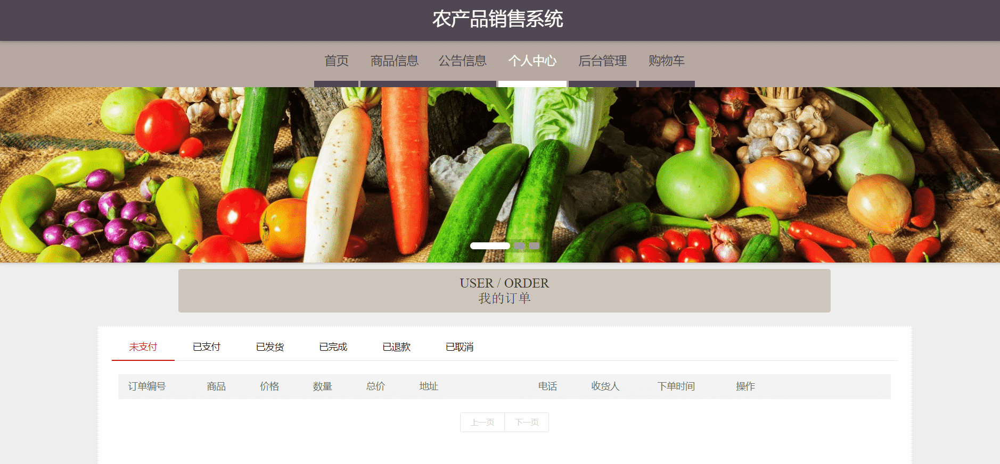

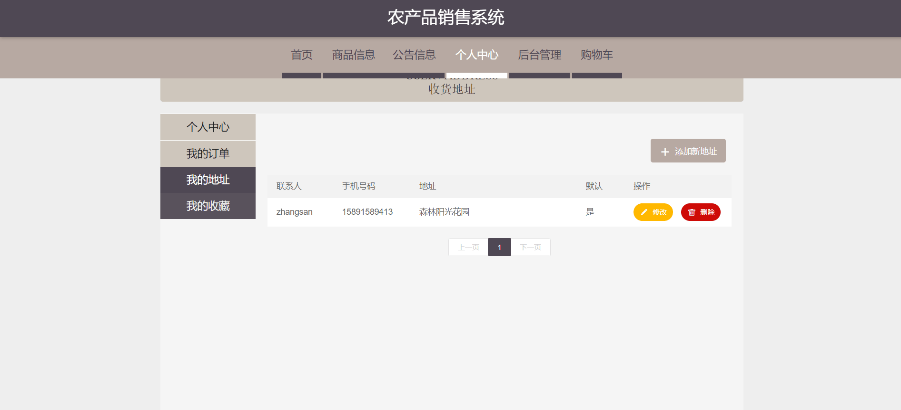

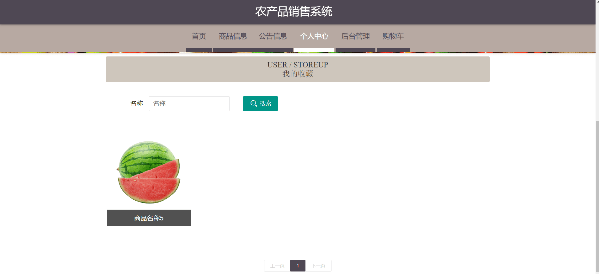

#### 2、后台


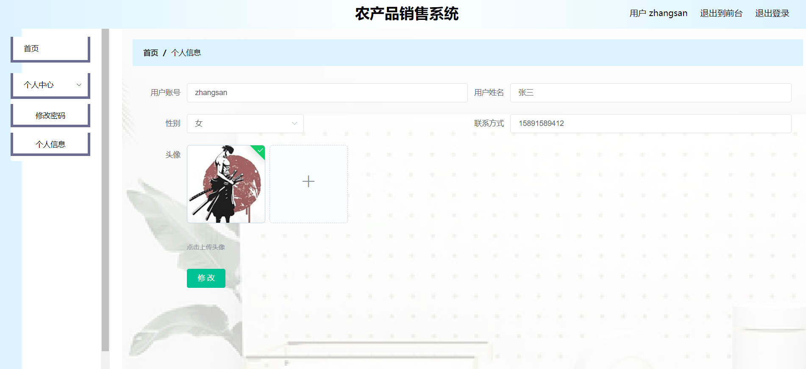

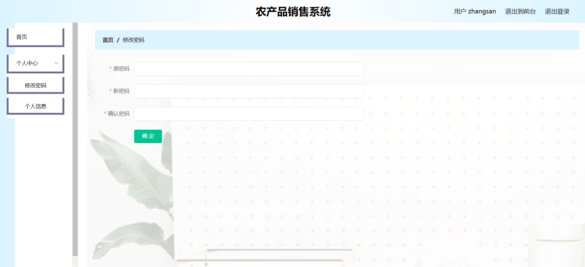

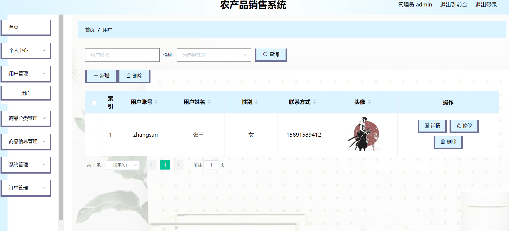

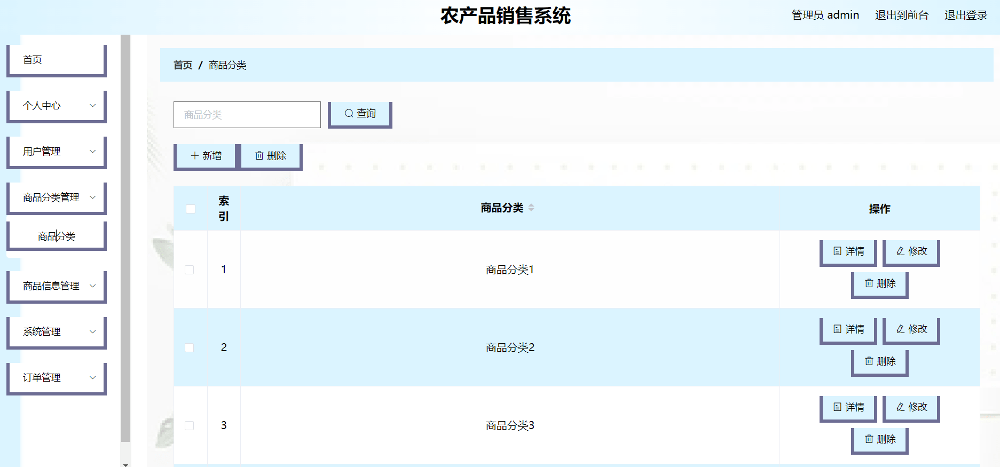

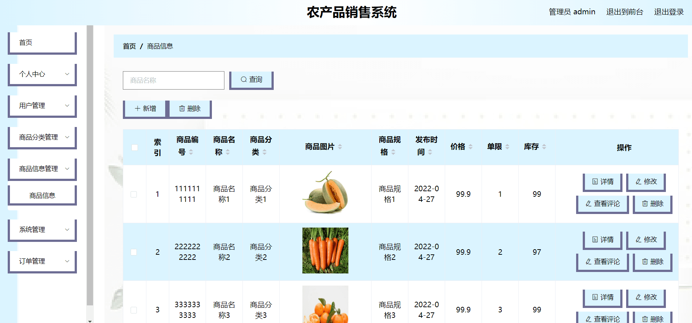

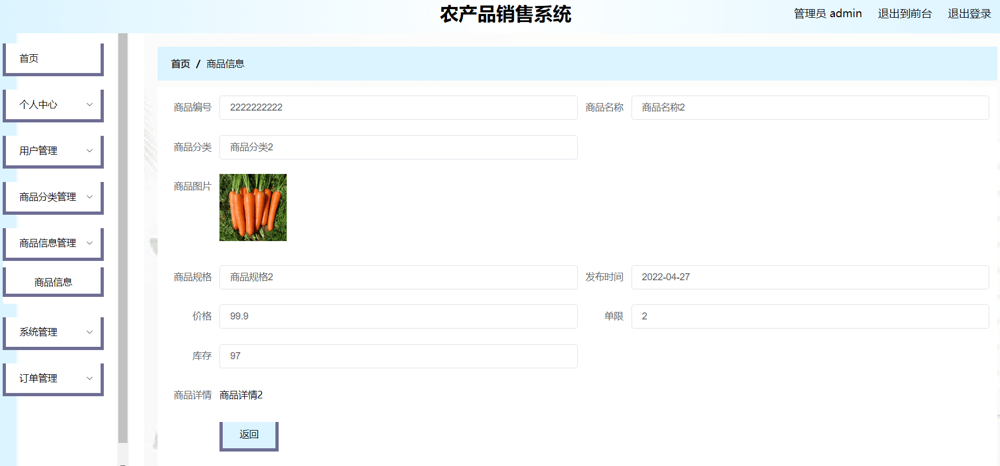

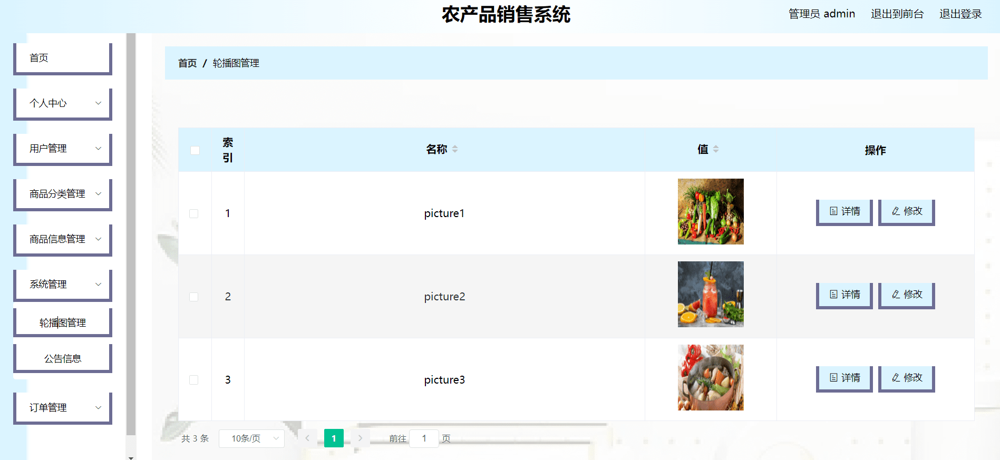

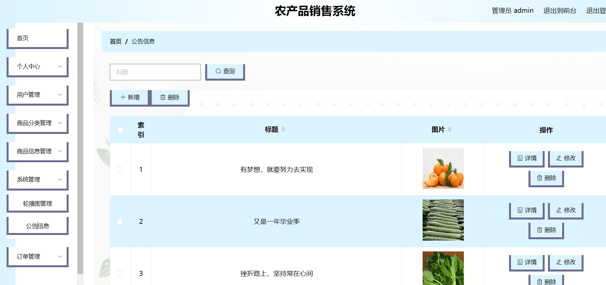

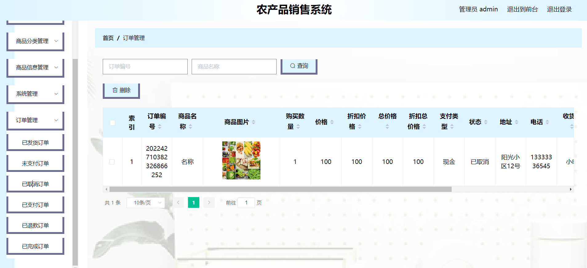

### 五、安装步骤

#### 1、数据库建库，运行SQL语句

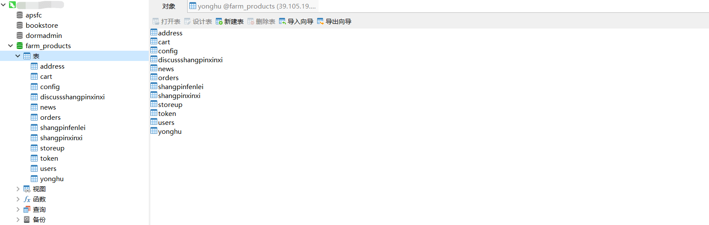

#### 2、Idea配置好yml文件后运行

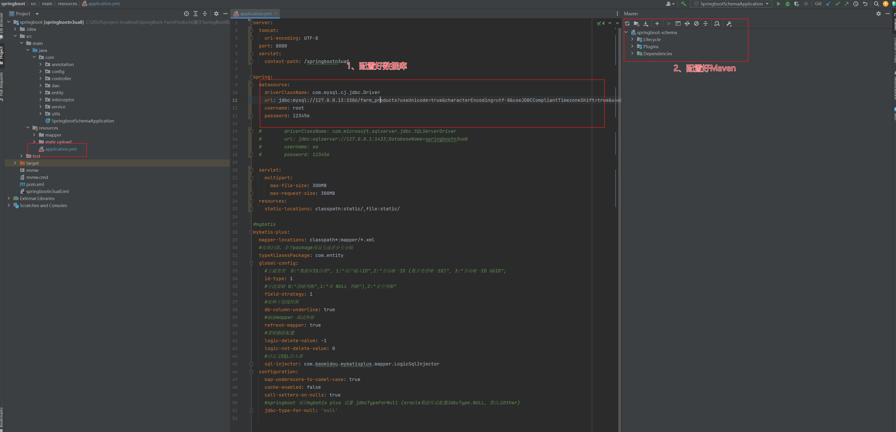

#### 3、新打开IDEA窗口，运行front前台文件夹


#### 4、运行前台，打开VSCode

```java 
1、cnpm install
2、cnpm run serve
```

或者

```java 
1、npm install
2、npm run serve
```

#### 5、访问地址

前台：http://localhost:63342/front/index.html?_ijt=egpvqf8bq7qdbgc49aksin7i1g&_ij_reload=RELOAD_ON_SAVE（账号密码： zhangsan/123456）

后台：http://localhost:8081/（账号密码：admin/admin）

### 六、框架技术

* element-UI

* Lay-UI

* HTML5

* JavaScript

* CSS

* SpringBoot

* Maven

* myBatis

* Shior