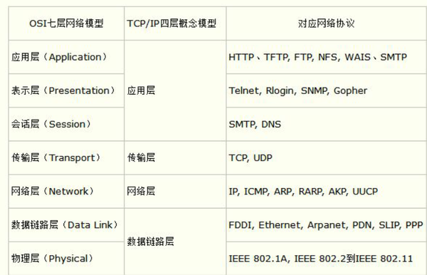
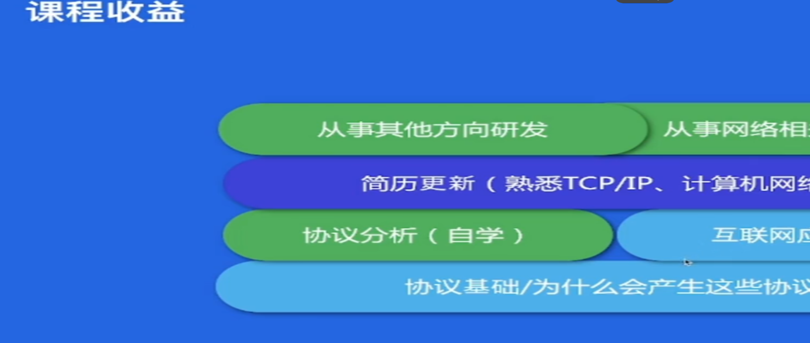
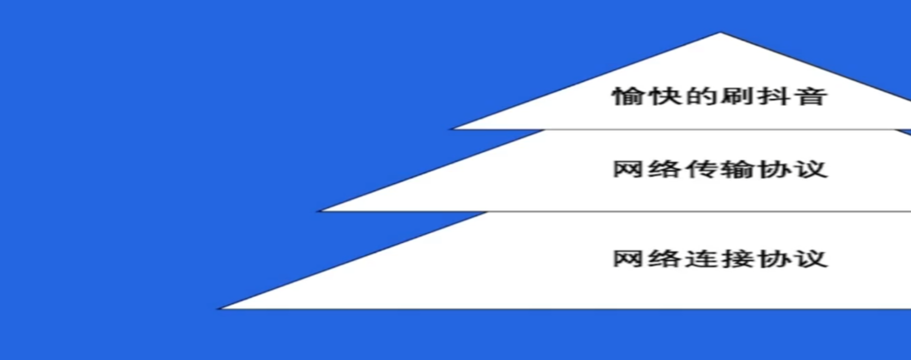

+++
title = '字节训练营记录'
date = 2024-11-01T19:33:34+08:00


categories = ["字节" ] 
tags = ["学习记录"]

+++


# 字节训练营


## 结营要求


- 刷题打卡 > 50 

- 每天3题

- 博客要写至少6篇

  


## 课程

1. 第一门课程 Go 语言上手-基础语言，也就是说现在你们听的这门课程。 主要讲述语言基础语法、入门实战
2. 第二门课程 Go 语言上手-工程实践 主要讲述 并发编程、依赖管理、单元测试、项目实战
3. 第三门课程 高质量编程与性能调优实战。主要讲述 编码规范、性能优化建议、性能分析工具使用、性能优化流程
4. 第四门课程 高性能 Go 语言发行版优化与落地实践。主要讲述 自动内存管理、Go 内存管理及优化、编译器和静态分析、Go 编译器优化


# 并发编程

1. 协程
2. 通道
3. sync


# 测试


# HTTP协议


超文本传输协议包含

1. 请求行
2. 请求头
3. 请求体





传输的包大部分是4k以下


# “Benchmark”

“Benchmark” 是一个评估性能或效率的标准或测试。

在计算机科学和程序开发中，它通常指以下几个方面：

1. **性能测试**：
   - 用于衡量程序、算法或系统在特定条件下的运行效率。常见的基准测试包括处理速度、内存使用、响应时间等。
2. **基准工具**：
   - 一些工具和框架专门用于执行基准测试，帮助开发者比较不同实现或版本的性能表现。例如，Go 语言内置的 `testing` 包支持基准测试，通过 `Benchmark` 函数来评估代码执行的速度。
3. **行业标准**：
   - 行业内的基准参考，用于对比不同产品或服务的性能。例如，计算机硬件的性能基准，可以帮助用户选择合适的设备。

### 基准测试示例（Go 语言）

在 Go 语言中，你可以使用以下方式进行基准测试：

```go
package main

import (
    "testing"
)

// 被测试的函数
func add(a, b int) int {
    return a + b
}

// 基准测试
func BenchmarkAdd(b *testing.B) {
    for i := 0; i < b.N; i++ {
        add(1, 2)
    }
}
```


# 刷题笔记


# 打开抖音互联网发生什么





熟悉TCP/IP , 计算机网络


## 协议


## 打开抖音发生了什么过程

1. 连入互联网  
2. 路由 , 交换机 , 网络虚拟化 
3. 跨网段 
4. 路由不是对称的: 多路 图  
5. 路由协议 工作在ip层 但也没这么简单  
6. 路由不改IP地址 , 路由是改Mac  找到发包口 
7. ARP协议 广播  , 免费ARP协议
8. ARP代理 
9. IPV6  , ip冲突情况 解决方案
10. IP协议  , mac 地址不能代替ip地址 , 向下兼容 协议 
11. ipv4  不够用 , 解决 , NAT  , 


网路打通后 , 视频下载


1. 网络传输 , 数据包 
2. DNS请求 
3. UDP协议 ,  分片 , 丢包 , 传输效率  和质量
4. TCP 协议  3次握手  ,  timewait  , 
5. HTTP / HTTP 1.1
6. HTTPS  加密 
7. SSL/TLS 握手 ,  对称和非对称加密





# 网络架构给抖音提质


网络提速

1. 网络提速 HTTP2.0  ,  多路复用  , stream , TCP丢包怎么办 , 
2. 对头阻塞 如何解决 , QUIC / HTTP3.0 , UDP 还是TCP   , kernel  还是usersapce  ,  0 RRT ,  弱网优势 


路径优化  

1. 数据中心分布 
2. 同运营商访问   , 通过解析 分析IP 
3. 静态资源 路径优化 CDN ,  静态缓存 , 边缘机房 --->  汇聚机房 ---> 核心机房 访问 
4. 动态API 播放 评论接口 , 路径优化 DSA 


网络稳定 

1. 容灾概念  ,  故障发生 - 故障感知- 自动切换 -  服务恢复
2. 故障排除:  故障明确 - 故障止损 - 分段排查 (客户端 , 服务端 , 中间链路)
3. 故障预防 : 监控报警  - 故障演练 - 故障降级 / 止损 


# 网络接入的问题 

域名系统

1. host管理 , 面临很多问题 
2. 域名系统 替换 host 
3. 域名购买 ,  配置迁移 
4. 开放外部用户访问  , 建设外部网站 

自建DNS服务器

1. DNS查询过程 
2. DNS 记录类型 
3. 权威DNS系统架构 

接入HTTPS

1. 对称加密 和 非对称加密 
2. SSL的 通信过程 
3. 证书链  
4. 使用 HTTPS  

接入全站加速 


全站加速 =  静态加速 + 动态加速


1. 静态加速 CDN  , 缓存
2. 动态加速 DCDN  , 原理 , 
3. 全站加速应用场景 : 用户登录 : 动态加速 ,  短视频加载观看 : 静态加速 ,  网页浏览 :  静态加速 + 动态加速


