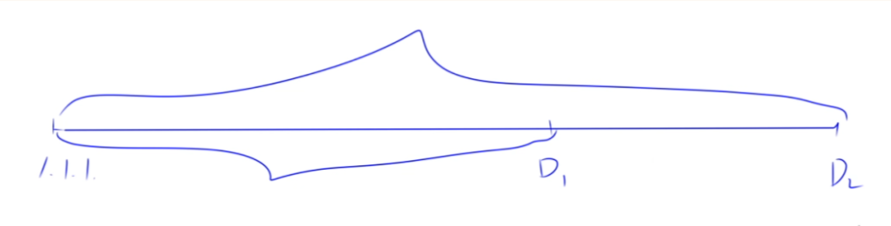

+++
title = '蓝桥杯备战'
date = 2024-10-12T14:55:08+08:00

categories = ["算法" ] 
tags = ["算法", "蓝桥杯", "竞赛"]

+++

# 二分

## *整数*二分算法模板

—— 模板题 AcWing 789. 数的范围

cpp除法默认是向下取整: 如 `5 / 2 = 2 ` 

上取整 ==> `5 / 2 = 3`  ==>  `5+1 >> 1` 

下取整 ==> `5 / 2 = 2` 


> `>> ` **右移运算符（Bitwise Right Shift）**

用于将一个整数的二进制位向右移动指定的位数。每右移一位，相当于**将数值除以 2。**


```cpp
int x = 8; // 二进制 1000
int y = x >> 2; // 结果是 2，二进制 0010
```

## 模板

**整数数组必须是*升序排列***                   

L和R 都是下标         

确定 mid(坐标)  , 然后套模板           

**L L L *mid* mid+1 r r r	//mid 在左边 ,  mid = L + r >> 1 , 自动取左 **         

(尽量选 mid 在左边)


**L L L mid-1 *mid* r r r  //mid 在右边 , mid = L + r + 1 >> 1**              

```c

bool check(int x) { /* ... */ } // 检查x是否满足某种性质

// 区间[l, r]被划分成[l, mid]和[mid + 1, r]时使用：

l l l mid mid+1 r r r	//mid 在左边 , l + r >> 1 , 自动取左

int bsearch_1(int l, int r)
{
    while (l < r)
    {
        int mid = l + r >> 1;
        if (check(mid))
            r = mid; // check()判断mid是否满足性质
        else
            l = mid + 1;
    }
    return l;
}

// 向上取整

// ------------------------------------------------------------------------

// 向下取整

// 区间[l, r]被划分成[l, mid - 1]和[mid, r]时使用：

l l l mid-1 mid r r r  //mid 在右边 , l + r + 1 >> 1

int bsearch_2(int l, int r)
{
    while (l < r)
    {
        int mid = l + r + 1 >> 1;
        if (check(mid))
            l = mid;
        else
            r = mid - 1;
    }
    return l;
}

```


> 如果数据单调, 意味着可以二分


> 二分就是找两段不同性质数据的**分界点**


## *浮点数*二分算法模板 

—— 模板题 AcWing 790. 数的三次方根

```c
bool check(double x) {/* ... */} // 检查x是否满足某种性质

double bsearch_3(double l, double r)
{
    const double eps = 1e-6;   // eps 表示精度，取决于题目对精度的要求
    while (r - l > eps)
    {
        double mid = (l + r) / 2;
        if (check(mid)) r = mid;
        else l = mid;
    }
    return l;
}
```


# 前缀和

## ***作用*** :   快速求出一个区间的**和** , O(1) 

`S[i] 为前缀和`

1. `S[i] = a[1]+ a[2] + .... + a[i]` , `S[0] = 0` (默认) 
2. `S[i] = S[i-1] + a[i]` 
3. 求a数组中任意区间`[l,r]`的和 : `S[r] - S[l-1]`  , **注意**是求的是第 `L` 个 到 第 `R` 个数的和 (不是下标)

```c
s[R]      =  a[1] + ... + a[L-1] + a[L] + ... + a[R] 
s[L - 1]  =  a[1] + ... + a[L-1] 
  
//结论
s[R] - s[L - 1] = a[L] + ... + a[R]
```


# 差分


## yxc: 差分是前缀和的逆运算

```c


a1 a2 ... an //数组前缀和 

   构造 b1 b2 ... bn
   使得 ai = b1 + b2 +  ... + bi
   
   b1 = a1 
   b2 = a2 - a1 
   b3 = a3 - a2
   ...
   bn = a_n - a_n-1
    	


```

> 可以实现 `O(1)` 时间把**某一个数组区间**的每一个值加上一个值 `X`  

```c
example: 
// a 是原数组 , b 是差分数组
    b_l   + x 
    b_r+1 - x 
    
```


- 一开始可以把a看成 0 0 0 ... 0      
- 通过插入insert操作得到a数组

```c
void insert(int l, int r, int c)
{
    b[l] += c;
    b[r + 1] -= c;
}
```


## 林小鹿: 类似于数学中的求导和积分，差分可以看成前缀和的逆运算。

差分数组：

- 首先给定一个原数组a：a[1], a[2], a[3],,,,,, a[n];

- 然后我们构造一个数组b ： b[1] ,b[2] , b[3],,,,,, b[i];

- 使得 a[i] = b[1] + b[2 ]+ b[3] +,,,,,, + b[i]

- 也就是说，a数组是b数组的前缀和数组，反过来我们把b数组叫做a数组的差分数组。换句话说，每一个a[i]都是b数组中从头开始的一段区间和。


考虑如何构造差分b数组？

最为直接的方法

如下：

```c

a[0 ]= 0;

b[1] = a[1] - a[0];

b[2] = a[2] - a[1];

b[3] =a [3] - a[2];

........

b[n] = a[n] - a[n-1];

```

我们只要有b数组，通过前缀和运算，就可以在O(n) 的时间内得到a数组 。

知道了差分数组有什么用呢？ 别着急，慢慢往下看。

话说有这么一个问题：

给定区间[l ,r ]，让我们把a数组中的[ l, r]区间中的每一个数都加上c,即 a[l] + c , a[l+1] + c , a[l+2] + c ,,,,,, a[r] + c;

暴力做法是for循环l到r区间，时间复杂度O(n)，如果我们需要对原数组执行m次这样的操作，时间复杂度就会变成O(n*m)。有没有更高效的做法吗? 考虑差分做法。

- 始终要记得，a数组是b数组的前缀和数组，比如对b数组的b[i]的修改，会影响到a数组中从a[i]及往后的每一个数。

- 首先让差分b数组中的 b[l] + c ,a数组变成 a[l] + c ,a[l+1] + c,,,,,, a[n] + c;

- 然后我们打个补丁，b[r+1] - c, a数组变成 a[r+1] - c,a[r+2] - c,,,,,,,a[n] - c;


为啥还要打个补丁？

- b[l] + c，效果使得a数组中 a[l]及以后的数都加上了c(红色部分)，但我们只要求l到r区间加上c, 因此还需要执行 b[r+1] - c,让a数组中a[r+1]及往后的区间再减去c(绿色部分)，这样对于a[r] 以后区间的数相当于没有发生改变。

- 因此我们得出一维差分结论：给a数组中的[ l, r]区间中的每一个数都加上c,只需对差分数组b做 b[l] + = c, b[r+1] - = c。时间复杂度为O(1), 大大提高了效率。

```c
//差分 时间复杂度 o(m)
#include<iostream>
using namespace std;
const int N = 1e5 + 10;
int a[N], b[N];
int main()
{
    int n, m;
    scanf("%d%d", &n, &m);
    for (int i = 1; i <= n; i++)
    {
        scanf("%d", &a[i]);
        b[i] = a[i] - a[i - 1];      //构建差分数组
    }
    int l, r, c;
    while (m--)
    {
        scanf("%d%d%d", &l, &r, &c);
        b[l] += c;     //将序列中[l, r]之间的每个数都加上c
        b[r + 1] -= c;
    }
    for (int i = 1; i <= n; i++)
    {
        a[i] = b[i] + a[i - 1];    //前缀和运算
        printf("%d ", a[i]);
    }
    return 0;
}


```


# 双指针

## (双指针) O(n) 必要条件

1. 先考虑暴力方式 
2. 确定目标数组的单调性 


- i从 0开始 从前往后遍历
- j从 m - 1开始 从后向前遍历

```cpp
#include <iostream>
#include <algorithm>

using namespace std;

const int N = 10001;

int a[N], b[N];

int main()
{

    int n, m, x;
    cin >> n >> m >> x;

    for (int i = 0; i < n; i++)
        cin >> a[i];
    for (int i = 0; i < m; i++)
        cin >> b[i];

    // sort(a,a+n);
    // sort(b,b+m); //必须保证两个数组都是单调的

    for (int i = 0, j = m - 1; i < n; i++)
    {
        while( j >= 0 && a[i] + b[j] > x) 
        {
            j--;
        }
        if(a[i] + b[j] == x)
        {
            cout << i << " " << j;
            break;
        }
    }

        return 0;
}

```


```c
#include <iostream>
#include <algorithm>

using namespace std;

const int N = 100100;

int a[N], b[N];

int main()
{
    int n;
    cin >> n;

    for (int i = 0; i < n; i++)
    {
        cin >> a[i];
    }

    int ans = 0;

    for (int i = 0, j = 0; i < n; i++)
    {
        b[a[i]]++;
        while (b[a[i]] > 1)
        {
            b[a[j]]--;
            j++;
        }
        ans = max(ans, i - j + 1);
    }
    cout << ans;

    return 0;
}

```


# 归并排序


## 分治

## 模板

```c
void merge_sort(int q[], int l, int r)
{
    if (l >= r) return;

    int mid = l + r >> 1;
    merge_sort(q, l, mid);
    merge_sort(q, mid + 1, r);

    int k = 0, i = l, j = mid + 1;
    while (i <= mid && j <= r)
        if (q[i] <= q[j]) tmp[k ++ ] = q[i ++ ];
        else tmp[k ++ ] = q[j ++ ];

    while (i <= mid) tmp[k ++ ] = q[i ++ ];
    while (j <= r) tmp[k ++ ] = q[j ++ ];

    for (i = l, j = 0; i <= r; i ++, j ++ ) q[i] = tmp[j];
}

```


L L L r r r


1. 确定分界点
2. 递归排序 left  right 
3. 归并 -- 合二为一


# 多路归并


重点是 merge() 函数


# 贡献法


- 是一种数学思想
- 原本是对矩阵的**行**进行操作, 换一种方式, 变成对矩阵的**列**进行操作
- 孤独的区间 , 只有1个

|           | n➡️  0 | 1    | 2    | ...  | n    |
| --------- | ----- | ---- | ---- | ---- | ---- |
| 所有区间⬇️ |       |      |      |      |      |
|           |       |      |      |      |      |
|           |       |      |      |      |      |
|           |       |      |      |      |      |


> 子串是连续的


# 日期问题


## 求闰年模板

```c
const int months[] = {0, 31, 28, 31, 30, 31, 30, 31, 31, 30, 31, 30, 31};
// 一三五七八十蜡，三十一天永不差
// 一、1、3、5、7、8、10、12 每月31天，4、6、9、11为30天。 二、2月正常为28天，如果为闰年，则多一天为29天。

int is_leap(int year) //判断闰年
{
    if (year % 4 == 0 && year % 100 || year % 400 == 0)
        return 1;
    return 0;
}

int get_days(int y, int m) 
{
    if ( m == 2)
        return 28 + is_leap(y);
}

```

```c
int months[13] = {0, 31, 28, 31, 30, 31, 30, 31, 31, 30, 31, 30, 31};
bool check(int date) // 判断日期是否合法
{
    int year = date / 10000;
    int month = date % 10000 / 100;
    int day = date % 100;

    if (!day || month < 0 || month > 12)
        return false;
    if (month != 2 && day > months[month])
        return false;
    if (month == 2)
    {
        if ((year % 4 == 0 && year % 100 != 0) || (year % 400 == 0)) // 闰年特判
        {
            if (day > 29)
                return false;
        }
        else
        {
            if (day > 28)
                return false;
        }
    }
    return true;
}
```


## 求区间天数



> 思想是计算各个日期到公元1.1.1的天数, 再将计算结果相减+1 , 得到结果


模板

```c
int months[13] = {0, 31, 28, 31, 30, 31, 30, 31, 31, 30, 31, 30, 31};
		//		    一      三      五      七  八      十       蜡，三十一天永不差
//或
const int months[] = {0, 31, 28, 31, 30, 31, 30, 31, 31, 30, 31, 30, 31};
```


```c
#include <iostream>
#include <cstdio>
#include <algorithm>
#include <string>

using namespace std;

int months[13] = {0, 31, 28, 31, 30, 31, 30, 31, 31, 30, 31, 30, 31};

int day(int n)
{
    int y = n / 10000;       // 年
    int m = n % 10000 / 100; // 月
    int d = n % 10000 % 100; // 日
    // 首先更新一下计算年份的二月天数有多少
    // 闰年包括普通闰年和世纪闰年
    // 普通闰年年分是4倍数不是100倍数（），世纪闰年是400的倍数，
    // 即100的倍数不是4的倍数不是闰年，如1900
    
    
    // 判断闰年
    if (y % 4 == 0 && y % 100 != 0 || y % 400 == 0)
        months[2] = 29;
    else // 不加这个会错
        months[2] = 28;
    
    
	//统计当前年份的总天数 (今年的天数)
    while (m--)
        d += months[m];
    
   	//计算从公元1年开始开始，一直到<去年>最后一天,不是到0000年
    while (y--)
		d += (y % 4 == 0 && y % 100 != 0 || y % 400 == 0 ? 366 : 365); // 闰年366天，平年365天
    
    return d;
}

int main()
{
    int a, b;

    while (cin >> a >> b)
        cout << abs(day(a) - day(b)) + 1 << endl;
    // 由题所示“如果两个日期是连续的我们规定他们之间的天数为两天”，因此我们加一

    return 0;
}
```


# 区间合并


> 任意多个区间的范围有交集, **快速**把这几个区间合并

> 贪心思想

模板ycx

```c
// 将所有存在交集的区间合并
void merge(vector<PII> &segs)
{
    vector<PII> res;

    sort(segs.begin(), segs.end());

    int st = -2e9, ed = -2e9;
    for (auto seg : segs)
        if (ed < seg.first)
        {
            if (st != -2e9) res.push_back({st, ed});
            st = seg.first, ed = seg.second;
        }
        else ed = max(ed, seg.second);

    if (st != -2e9) res.push_back({st, ed});

    segs = res;
}


```


1. 按区间左端点排序

2. start_________________________end    三种情况⬇️

   1. ​     f-----s   在区间内     这情况等于不用操作
   2. ​          f----------------------s  右端点超出
   3. ​                                   f----------s  全部超出        


```c
void merge(vector<Pii> &segment)
{
    vector<Pii> ans;

    sort(segment.begin(), segment.end()); // 默认排序左端点

    int start = -2e9, end = -2e9;

    for (auto seg : segment)
    {
        if (end < seg.first)
        {
            if (start != -2e9) // 没有交集
                ans.push_back({start, end});
            start = seg.first, end = seg.second;
        }
        else
        {
            end = max(end, seg.second); //合并情况不添加ans
        }
    }
    if (start != -2e9) // 防止vector是空集 , 空集就是也是一个区间
        ans.push_back({start, end});
    segment = ans;
}
```


# 递归


